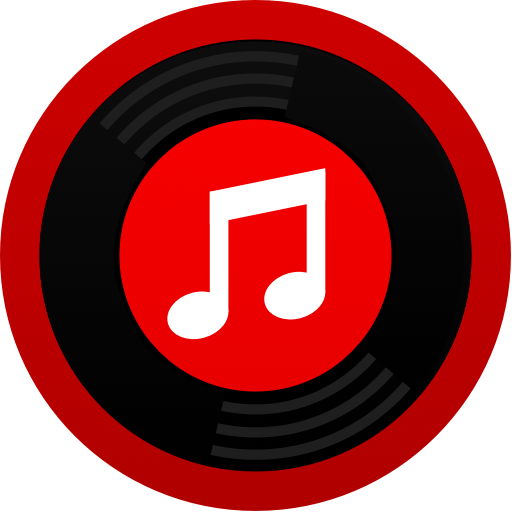

---

  

<h1 align="center">YT Music Player</h1>

This little app was inspired by  [rosswaycaster/XM-Menu-Player](https://github.com/rosswaycaster/XM-Menu-Player/). This little menu bar [Electron](https://www.electronjs.org/) application wraps the YouTube Music web player. It also displays the current artist and song title in the menu bar. Enjoy! 🎶

---

### Requirements

 - **yarn**

### Supported Platforms

 - **Mac**
 - **Windows**
 - **Linux**

### Instructions

1. Download this repo.
2. Open the folder in your command line or Terminal.
3. Run `yarn install`.
4. Then run `yarn package`.
5. Check the `out` folder for the packaged application to run.

---

🧑‍⚖️ This is an unofficial application and not published or supported by YouTube or Google llc. Intended for personal and educational purposes. I am liable for nothing.
